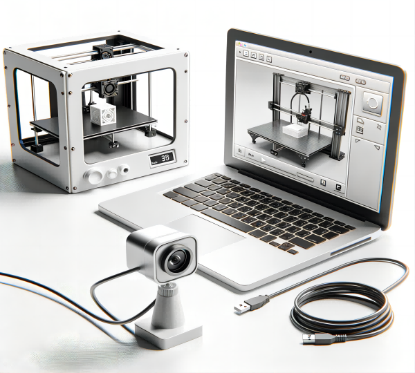

# An Intelligent and Integrated Platform for Quality Control and Fault Diagnosis in 3D Printing

This project presents an intelligent and integrated platform for quality control and fault diagnosis in 3D printing. The platform leverages state-of-the-art technologies, including large language models (LLMs), knowledge bases, and computer vision, to address the limitations of traditional quality control methods and provide a comprehensive solution for real-time monitoring, defect detection, and user interaction.

## Key Features

- **Real-time Monitoring and Defect Detection**: The platform integrates the YOLOv8 object detection algorithm for real-time monitoring and defect detection in 3D printed parts. It can accurately identify and localize common defects such as spaghetti, stringing, zits, under-extrusion, and warping.

- **Conversational Fault Diagnosis**: A GPT-based chatbot is fine-tuned on a dataset of 3D printing troubleshooting conversations to provide intelligent and interactive fault diagnosis. Users can engage in natural language conversations with the chatbot to receive accurate and informative guidance on resolving printing issues.

- **Knowledge Base Integration**: The platform utilizes LLMs and the Langchain framework to construct a localized knowledge base specific to 3D printing. This knowledge base serves as a foundation for providing accurate and context-aware information to users through the chatbot interface.

- **Multimodal Diagnostic Approach**: The platform combines visual data from the monitoring system with user inputs through the chatbot interface to enable a comprehensive and accurate diagnosis of 3D printing issues. This multimodal approach leverages both objective data and subjective user information for effective problem-solving.

- **Notification and User Interaction**: The platform includes real-time notification functionalities to alert users of detected defects and anomalies. It also provides a user-friendly chatbot interface for intuitive interaction and seamless integration with the monitoring system and knowledge base.

## Dataset

The project utilizes a diverse dataset of 3D printed part images, carefully curated to represent a wide range of defects and printing scenarios. The dataset includes samples from various materials (PLA, ABS, PETG, nylon) and printing technologies (FDM, SLA, SLS). The images are annotated by experts to ensure accurate labeling of defects.

The dataset is augmented using techniques such as rotation, flipping, scaling, and translation to enhance the model's robustness and generalization capabilities. It is divided into training, validation, and testing subsets to facilitate model development and evaluation.

## Technologies Used

- **YOLOv8**: A state-of-the-art object detection algorithm used for real-time defect detection in 3D printed parts.
- **Large Language Models (LLMs)**: GPT-based models fine-tuned on domain-specific data for conversational fault diagnosis and knowledge base construction.
- **Langchain**: A framework for building applications with LLMs, used for integrating the knowledge base and chatbot components.
- **Computer Vision**: Image processing and analysis techniques used for data preprocessing, augmentation, and visualization.
- **Natural Language Processing (NLP)**: Techniques used for text processing, intent recognition, and dialogue management in the chatbot component.

## Getting Started

To get started with this project, follow these steps:

1. Clone the repository: `git clone https://github.com/yourusername/3d-printing-quality-control.git`
2. Install the required dependencies: `pip install -r requirements.txt`
3. Prepare the dataset by following the instructions in the `data` directory.
4. Train the YOLOv8 model using the provided scripts in the `models` directory.
5. Fine-tune the GPT model on the 3D printing troubleshooting dataset.
6. Integrate the trained models with the chatbot and knowledge base components.
7. Launch the platform and interact with the chatbot interface for fault diagnosis and quality control.

For detailed instructions and documentation, please refer to the `docs` directory.

## Contributions

Contributions to this project are welcome. If you encounter any issues or have suggestions for improvements, please open an issue or submit a pull request on the GitHub repository.

## License

This project is licensed under the MIT License. See the `LICENSE` file for more information.

## Acknowledgments

We would like to thank the experts who contributed to the annotation of the dataset and the open-source community for their valuable tools and resources that made this project possible.

## How to RUN?


### Preparation before running

You need to set up the Docker environment and install Docker Compose.

Currently, the compressed file contains the front end chatbot-client and the back end chatbot-server. The front end chatbot-client is developed using Vue.js, while the back end chatbot-server is developed using Python Django.

Both files have the corresponding Docker image build files set up, and the run commands are described below.

Moreover, it runs based on sqlite, which has already been configured by default with an API key stored. After running, you can configure the functionality via the admin interface.

Since some features are not used, try to keep the default settings for unrelated functions. If needed, you can enable them according to the code configuration.

### Running Steps

#### 1. Build three images for both front end and back end

##### a. Front End

Enter the `chatbot-client` directory and run the following command:

```bash
docker build -t chatbot:latest .
```

This command will create an image named `chatbot:latest`.


If you encounter dependency issues, use the following commands to install dependencies:

```bash
nvm install 18.0.0
nvm use 18.0.0
node -v
yarn install
```

##### b. Back End

Enter the `chatbot-server` directory and run the following command:

```bash
docker-compose build
```
This will create two images: `chatbot-web-server` and `chatbot-wsgi-server`, with the latter providing WSGI service for the former.

If you encounter Python dependency issues, use the following command to install dependencies:

```bash
pip install -r requirements.txt
```

#### 2. Run

Enter the chatbot-client directory and run the following command:

```bash
docker-compose up
```

#### 3. Usage

The database has already been pre-configured with an API key, which you can use directly.

Enter `http://localhost` in your browser to access the service.

Pre-configured administrator details:

Default superuser: admin

Default password: password

Enter `http://localhost:9000/admin` to access the management panel using the above administrator credentials.

| Service Name        | Local Machine Port | Docker Service | Nginx         |
|---------------------|--------------------|----------------|---------------|
| wsgi-server         | 8000               | 8000           |               |
| web-server          | 9000               | 80             |               |
| client              | CLIENT_PORT (800)  | 80             | Nginx 80/443  |
| backend-wsgi-server | WSGI_PORT (8000)   | 8000           |               |
| backend-web-server  | SERVER_PORT (9000) | 80             |               |


## Demo

Please Click picture:

[](https://www.youtube.com/watch?v=UoPQNJK_C9s)

## Contact us

For any questions or inquiries, please contact the project maintainer at `office@3dprinter.quest`. Or the Author Zongmin CAI `Charmingcaiusyd@gmail.com`